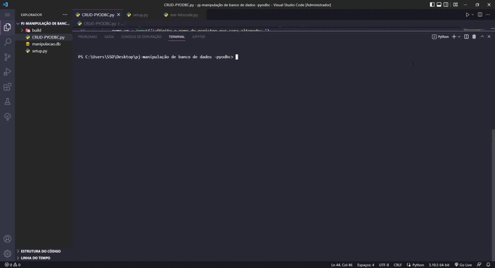

# CRUD com Python

 

## 👨‍💻 Sobre o projeto:
<a href="https://youtu.be/G6nDxY4Jwsc">Vídeo no Youtube</a>

   Um projeto de CRUD feito em python integrando a biblioteca pyodbc

Incialmente sem interface gráfica, esse mini sistema fornece ao usuario liberdade de Criar registro, Ler o banco de dados (exibi-lo na tela), Atualizar um registro existente, Deleter um registro existente e por fim, sair do sistema fechando a conexão com o banco de dados.

Esta é a primeira versão desse projeto, tenho interesse em aprimora-lo com funcionalidades de permissão, interface gráfica e etc

É necessário para rodar o programa:

- Biblioteca pyodbc - pip install pyodbc
- Driver Mysqlite3 

 

### 🚀 Tecnologias Utilizadas:

  </img>

 
